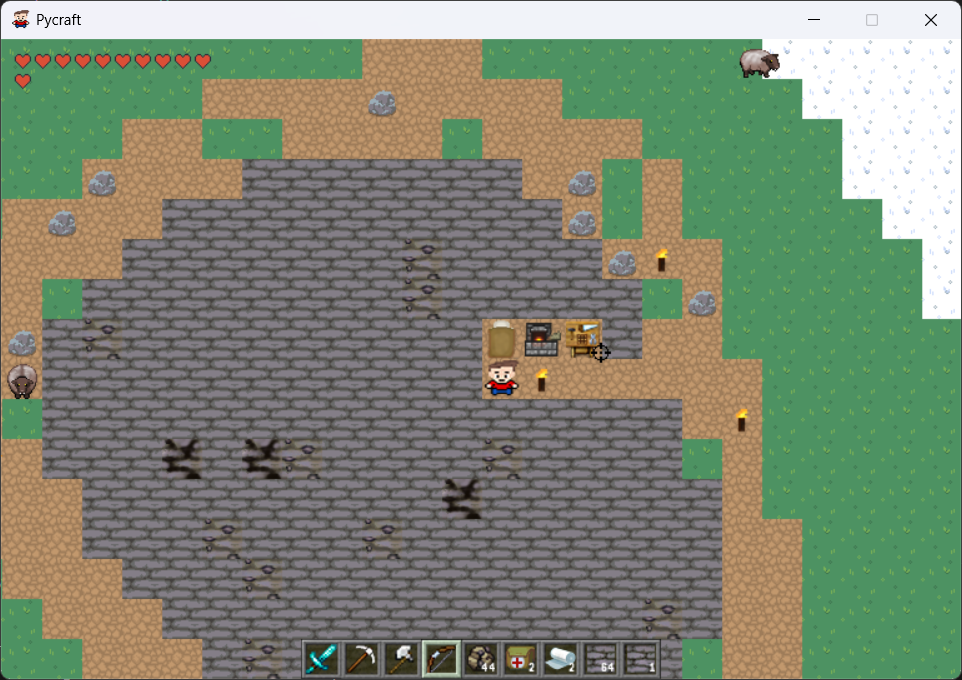
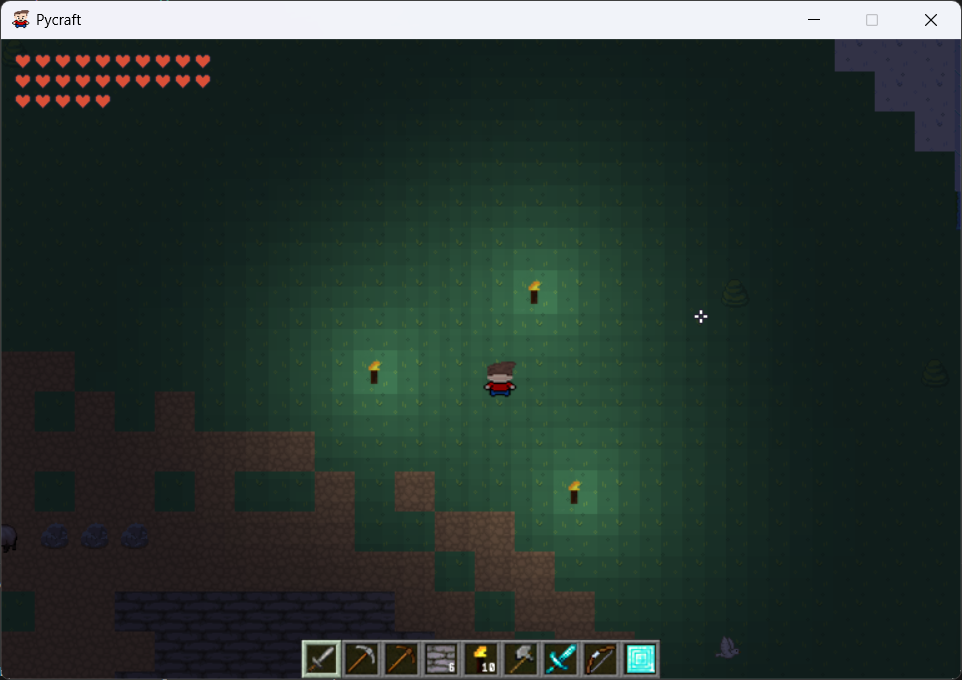

# PyCraft Game

**[Secondary School Project]**

This pygame game written in Python was one of my Retho TFE (secondary school final project).

## Screenshots

### Gameplay


### Gameplay by night



## Making the game an executable for

### Windows :
- ```pyinstaller -y --onefile --windowed main.py --add-data "textures;textures" --add-data "audio;audio" --add-data "data;data" --add-data "saves;saves" --add-data "Pixellari.ttf;." --icon=icon.ico``` \
(Remove --onefile if you want to customize the fame)

### Linux : 
- ```docker build -t pygame-builder .``` 
- --onefile :
    - ```docker run --rm -v ${PWD}:/output pygame-builder cp /app/dist/main /output/```\
- multiple file :
    - ```docker run --rm -v ${PWD}:/output pygame-builder bash -c "cp -r /app/dist/main /output/"```